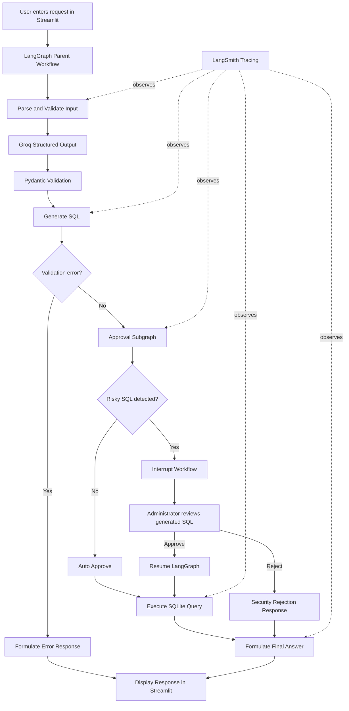
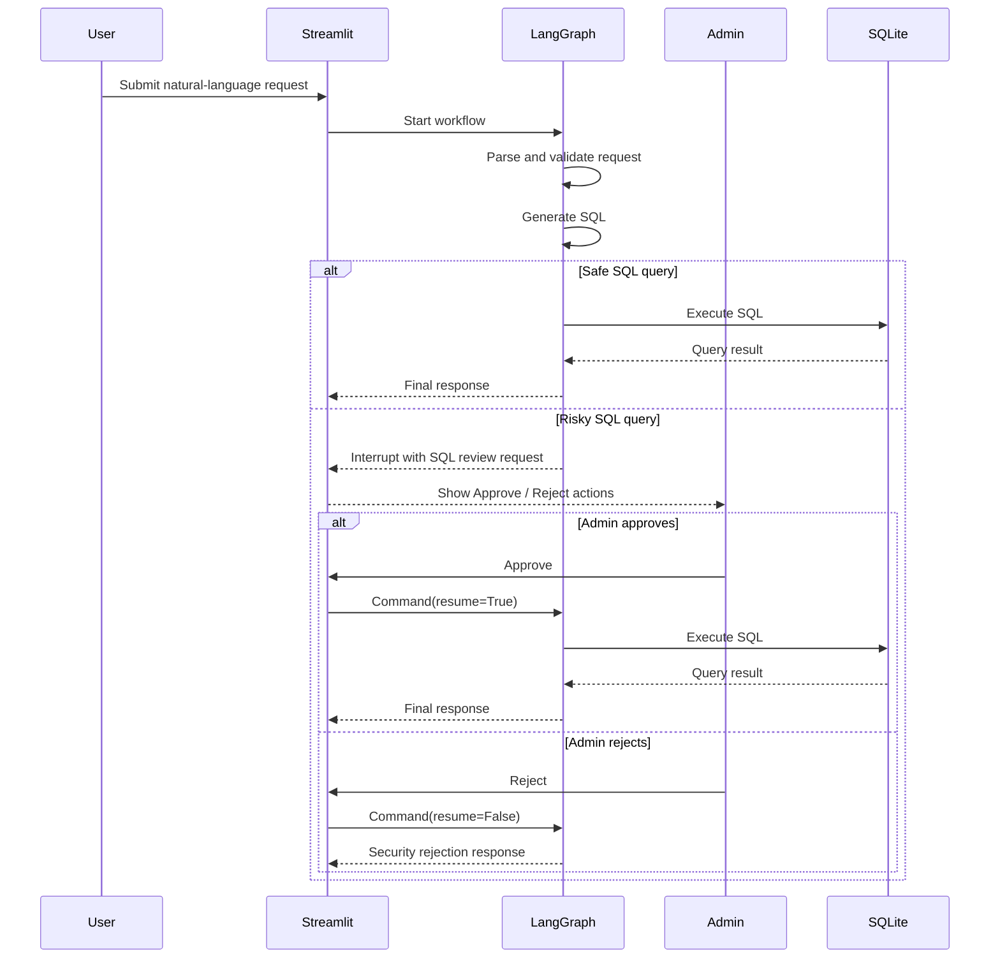

# Secure Text-to-SQL Agent with HITL, Guardrails & LangSmith

A Streamlit-based Text-to-SQL application that converts natural-language database requests into SQLite queries using Groq, LangChain, and LangGraph.

The project demonstrates a guarded AI-agent workflow for employee data. It uses structured LLM output, Pydantic validation, Human-in-the-Loop approval for risky SQL, and LangSmith tracing to make each request observable.

---

## Features

- Convert natural-language requests into SQL queries
- Query employee data with analytical SQL
- Support `SELECT`, `INSERT`, `UPDATE`, and `ALTER` request types
- Validate employee records with Pydantic
- Restrict this demo to the `users` table
- Pause structural or destructive SQL for administrator approval
- Display the current SQLite database state in Streamlit
- Trace LangGraph execution and Groq LLM calls in LangSmith
- Show generated SQL, approval status, query result, and final answer in the trace

---

## Demo Requests

### Safe analytical requests

```text
What is the maximum salary?
```

```text
Show all employees in Engineering.
```

```text
What is the average salary by department?
```

```text
Now show the table.
```

### Insert an employee

```text
Add a new employee named Rahul Sharma with role User in the Engineering department, salary 78000, joining date 2026-07-06.
```

### Request requiring approval

```text
Add a phone_number column to the users table.
```

The last request generates an `ALTER` statement, which triggers Human-in-the-Loop review before execution.

---

## Architecture



---

## Workflow

```text
User Request
→ Parse Request
→ Structured LLM Output
→ Pydantic Validation
→ Generate SQL
→ Safety Gate
→ Human Approval when required
→ Execute Database Query
→ Generate Final Response
```

---

## Guardrails

The application applies several checks before allowing a database operation to run.

### 1. Structured action validation

The LLM is required to return a structured `DatabaseWriteAction` object.

```python
class DatabaseWriteAction(BaseModel):
    action_type: Literal["SELECT", "INSERT", "UPDATE", "ALTER"]
    target_table: Literal["users"] = "users"
    payload: Optional[Dict[str, Any]] = None
    alter_statement: Optional[str] = None
```

This prevents the agent from selecting unknown tables and limits the operation to the allowed action types.

### 2. Employee data validation

For `INSERT` and `UPDATE` requests, the data payload is validated with `UserPayload`.

```python
class UserPayload(BaseModel):
    name: str
    role: Literal["Admin", "User", "Manager"]
    department: Literal[
        "Engineering",
        "HR",
        "Sales",
        "Marketing",
        "Finance",
    ]
    salary: float
    join_date: Optional[str]
```

Current validation rules:

- Name must contain at least 2 characters
- Name is normalized to title case
- Role must be `Admin`, `User`, or `Manager`
- Department must be one of the configured departments
- Salary must be greater than zero
- Join date must use `YYYY-MM-DD`
- Missing join dates default to the current date

### 3. Human-in-the-Loop safety gate

The safety subgraph checks the generated SQL for these risky keywords:

```python
destructive_keywords = [
    "DROP",
    "DELETE",
    "TRUNCATE",
    "ALTER",
]
```

When one is detected, LangGraph pauses with `interrupt(...)`. The Streamlit UI displays the generated SQL and gives the administrator two choices:

- **Approve & Execute Query**
- **Reject & Terminate Operation**

Read-only SQL such as `SELECT MAX(salary) FROM users;` is approved automatically.

---

## Human-in-the-Loop Flow



---

## LangSmith Tracing

LangSmith records the execution path of the LangGraph workflow, including LLM calls, structured parsing, routing, approval state, query output, and final response.

### Actual recorded trace

For the request:

```text
now show the table
```

the agent generated:

```sql
SELECT * FROM users;
```

The operation was recognized as a safe `SELECT` query, so it was auto-approved without triggering Human-in-the-Loop review.

The recorded trace showed:

| Metric | Observed value |
|---|---:|
| Individual LangGraph run duration | 2.47 seconds |
| Trace-view P50 displayed by LangSmith | 2.45 seconds |
| Tokens displayed in the trace summary | approximately 1.8K |
| Parse and validate node | 0.71 seconds |
| Structured `ChatGroq` extraction call | 0.70 seconds |
| Generate SQL node | 0.51 seconds |
| SQL-generation `ChatGroq` call | 0.50 seconds |
| Routing step | approximately 0.00 seconds |
| Approval subgraph and safety layer | approximately 0.00 seconds |
| Returned database rows | 7 employee records |
| Approval status | `true` |
| Validation error | `null` |

The trace output confirmed:

```text
generated_sql: SELECT * FROM users;
is_approved: true
validation_error: null
query_result: 7 employee records
```

This demonstrates the intended safe-query path:

```text
Parse and Validate
→ Generate SQL
→ Route After SQL Generation
→ Approval Subgraph
→ Safety Layer
→ Execute Query
→ Formulate Final Answer
```

### LangSmith screenshot

Save the trace screenshot in the project at:

```text
assets/langsmith-trace.png
```

Then GitHub will render it here:


### Evaluation readiness

This repository currently includes **LangSmith tracing**. A formal LangSmith dataset and automated evaluator are not implemented yet.

Recommended evaluation prompts:

```text
What is the average salary?
```

```text
Show all employees in Engineering.
```

```text
Add a user named Test Person with role Developer in Engineering, salary 50000.
```

```text
Delete all users from the database.
```

Recommended evaluation criteria:

| Evaluation metric | What it checks |
|---|---|
| Action classification accuracy | Whether the model selects `SELECT`, `INSERT`, `UPDATE`, or `ALTER` correctly |
| SQL execution success | Whether generated SQL executes without a database error |
| Schema validation accuracy | Whether invalid roles, salaries, departments, or dates are rejected |
| Guardrail compliance | Whether destructive or structural SQL pauses for approval |
| Final answer correctness | Whether the final answer accurately summarizes the query result |
| SQL safety | Whether unapproved dangerous operations are prevented |

---

## Project Structure

```text
secure-text-to-sql-agent/
│
├── app.py                 # Streamlit interface and approval controls
├── backend.py             # LangGraph workflow, LLM, SQL generation, and execution
├── schema.py              # Pydantic models and validation rules
├── requirements.txt       # Python dependencies
├── .env                   # API keys; do not commit
├── .gitignore
├── README.md
│
├── assets/
│   └── langsmith-trace.png
│
└── company.db             # Runtime SQLite database
```

| File | Purpose |
|---|---|
| `app.py` | Streamlit frontend, live database monitor, and approval interface |
| `backend.py` | LangGraph parent workflow, approval subgraph, SQL generation, and database execution |
| `schema.py` | Pydantic schemas for actions and employee data |
| `company.db` | SQLite database created or reset during runtime |
| `.env` | Groq and LangSmith credentials |
| `requirements.txt` | Python dependencies |
| `README.md` | Project documentation |

---

## Tech Stack

- Python 3.12
- Streamlit
- LangChain
- LangGraph
- Groq
- Pydantic v2
- SQLite
- SQLAlchemy
- LangSmith
- python-dotenv

---

## Installation

Clone the repository:

```bash
git clone https://github.com/YOUR-USERNAME/secure-text-to-sql-agent.git
cd secure-text-to-sql-agent
```

Create and activate a Python 3.12 virtual environment.

### Windows PowerShell

```powershell
py -3.12 -m venv .venv
.\.venv\Scripts\Activate.ps1
```

Install dependencies:

```powershell
pip install -r requirements.txt
```

---

## Requirements

Create `requirements.txt` with:

```txt
langchain
langchain-community
langchain-groq
langgraph
langsmith
streamlit
pydantic>=2.0,<3.0
python-dotenv
sqlalchemy
```

---

## Environment Variables

Create a `.env` file in the root directory:

```env
GROQ_API_KEY=your_groq_api_key_here

LANGSMITH_API_KEY=your_langsmith_api_key_here
LANGSMITH_TRACING=true
LANGSMITH_PROJECT=TEST_GUARDRAIL
```

Do not commit `.env`.

Recommended `.gitignore` entries:

```gitignore
.venv/
.env
__pycache__/
*.py[cod]
company.db
.streamlit/
```

---

## Run the Application

```powershell
streamlit run app.py
```

---

## Sample Database

The demo initializes a `users` table with the following records:

| ID | Name | Role | Department | Salary | Join Date |
|---:|---|---|---|---:|---|
| 1 | Alice | Admin | Engineering | 95000 | 2023-01-15 |
| 2 | Bob | User | Engineering | 72000 | 2024-03-10 |
| 3 | Carlos | Manager | Sales | 85000 | 2022-07-19 |
| 4 | Diana | User | Sales | 55000 | 2025-11-01 |
| 5 | Ethan | Manager | HR | 65000 | 2021-02-25 |
| 6 | Fiona | User | Finance | 110000 | 2023-09-05 |
| 7 | George | User | Engineering | 88000 | 2024-06-20 |

---

## Current Limitations

This is a learning and demonstration project. Before production use, improve the following:

- Replace f-string SQL construction with parameterized SQL queries
- Add a `filters` field for safe `UPDATE` operations
- Remove the hardcoded `WHERE id = 1` update condition
- Restrict raw `ALTER` statements more strictly
- Use a SQL parser or AST-based allowlist instead of simple keyword matching
- Add authentication and role-based access control
- Add audit logs for approvals and rejections
- Add database backups and rollback capability
- Build a formal LangSmith dataset and automated evaluators
- Mask sensitive production data before exporting traces to external observability tools

---

## Learning Concepts Demonstrated

- LangGraph state management
- LangGraph subgraphs
- Human-in-the-Loop interrupts
- Pydantic validation
- Structured LLM output
- Text-to-SQL workflows
- SQL guardrails
- Streamlit application development
- SQLite integration
- LangSmith tracing and observability
- Evaluation design for agent guardrails

---

## Author

Built as an AI engineering learning project focused on secure agent workflows, structured LLM output, guardrails, Human-in-the-Loop approval, and LangSmith observability.
